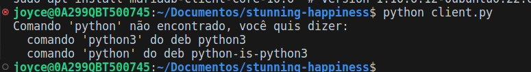

# Trabalho 1 - C115


## Integrantes do Projeto

1. **Pedro Oliveira Dias Pimenta Borem**
   - GitHub: [PedroBorem](https://github.com/PedroBorem)

2. **Joyce da Costa Dias**
   - GitHub: [dioic3](https://github.com/dioic3)

## Instruções para Executar o Projeto

### Requisitos

- **[Python 3.x](https://www.python.org/downloads/)**: Instale o Python 3.x instalado no seu sistema.
- **Bibliotecas Python:**
  - `socket`: A biblioteca `socket` é uma parte integrada do Python, então não é necessário instalá-la separadamente.
  - `mysql-connector-python`: Você pode instalar a biblioteca `mysql-connector-python` usando o gerenciador de pacotes pip. Execute o seguinte comando no terminal ou prompt de comando:
    ```
    pip install mysql-connector-python
    ```
- **[Docker](https://docs.docker.com/get-docker/):** Para garantir que tudo está funcionando conforme o esperado, é crucial instalar o docker. Você pode baixar e instalar o Docker a partir do site oficial do Docker. Siga as instruções de instalação para o seu sistema operacional.

### Passos para Executar

#### 1. Preparar o Ambiente

Se você optar por usar o Docker para o banco de dados MySQL:
1. Navegue até o diretório onde o arquivo `docker-compose.yml` está localizado.
2. Execute o comando para iniciar o contêiner MySQL em segundo plano.

```bash
docker-compose up -d
```

#### 2. Configurar o Banco de Dados

1. Navegue até o diretório onde o arquivo (`init.sql`) está localizado.
2. Execute o comando para criar o banco de dados e a tabela necessária.
```bash
mysql -u root -p < init.sql
```

#### 3. Executar o Servidor
1. Execute o comando para iniciar o servidor.
```bash
python server.py
```

#### 4. Executar o Cliente

1. Execute o comando para iniciar o cliente.
```bash
python client.py
```

**Observação**: Caso não dê para executar o comando do `python server.py` ou `python client.py` e dê o erro como na imagem abaixo, troque palavra `python` para `python3` e tente executar novamente.

- **Exemplo:**


#### 5. Interagir com o Quiz

Após iniciar o cliente, você começará a receber perguntas do servidor. Responda às perguntas digitando a letra correspondente à sua escolha e pressionando Enter. O servidor informará se a resposta está correta ou não. O quiz continuará até que não haja mais perguntas.

#### 6. Encerrar o Ambiente

Quando terminar de usar o projeto, encerre os processos de forma adequeada:

- Para o servidor e o cliente, feche os terminais onde estão sendo executados ou dê o comando `Ctrl + C` no terminal.
- Se estiver usando o Docker para o banco de dados MySQL, vá para o terminal onde o contêiner foi iniciado e execute o comando `docker-compose down` para parar e remover o contêiner.
.

